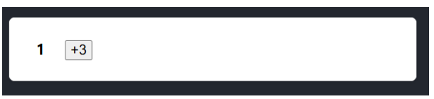

# State는 스냅샷처럼 동작한다.

#### 이것을 풀어 설명하자면, state 변수를 설정하여도 이미 가지고 있는 state 변수는 변경되지 않고, <br>대신 리렌더링이 발동된다.

#### state를 설정하면 렌더링이 동작한다.
##### 클릭과 같은 사용자 이벤트에 반응하여 사용자 인터페이스가 직접 변경되는 것이 아니다.
##### 인터페이스가 이벤트에 반응하려면 state를 업데이트해야 한다.

 
```javascript
export default function Form(){
    const [isSent, setIsSent] = useState(false);
    const [message, setMessage] = useState('Hi!');

    if(isSent){
        return <h1>Your message is on its way!</h1>
    }
    return(
        <form onSubmit={(e) => {
            e.preventDefault();
            setIsSent(true);
            sendMessage(message);
        }}>
            <textarea
                placeholder='Message'
                value={message}
                onChange={e => setMessage(e.target.value)}
            />

            <button type="submit">Send</button>
        </form>
    )
}

function sendMessage(message) {
    // ...
 }
 ```

##### 위 코드를 살펴보면 "send"를 누르면 setIsSent(true)는 React에 UI를 다시 렌더링하도록 지시하는 것을 확인할 수 있다.

1. onSubmit 이벤트 핸들러가 실행된다
2. setIsSent(true)가 isSent를 true로 설정하고 새로운 렌더링을 Queue에 넣는다.
3. React는 새로운 isSent값에 따라 컴포넌트를 다시 렌더링 한다.
#### 렌더링은 그 시점의 스냅샷을 찍는다.
##### 바로 이전 포스트에서 "렌더링"이란 React가 컴포넌트, 즉 함수를 호출하는 것이라고 배웠다.

##### 해당 함수에서 반환하는 JSX는 시간상 UI의 스냅샷과 같다.

##### prop, 이벤트 핸들러, 로컬 변수는 모두 렌더링 당시의 state를 사용해 계산된다.

##### 그러면 React는 이 스냅샷과 일치하도록 화면을 업데이트하고 이벤트 핸들러를 연결한다.

##### 결과적으로 버튼을 누르면 JSX의 클릭 핸들러가 발동되는 것이다.


#### 이해하기 쉽게 그림으로 살펴보자 !


##### 컴포넌트의 state는 메모리로써 함수가 반환된 후 사라지는 일반 변수와 다르다.

##### state는 React 자체에 "존재"하며 React가 컴포넌트를 호출하면 특정 렌더링에 대한 state의 스냅샷을 제공한다.

##### 컴포넌트는 해당 렌더링의 state 값을 사용해 계산된 새로운 props 세트와 이벤트 핸들러가 포함된 UI의 스냅샷을 JSX에 반환한다.

  

### 다음은 이것이 어떻게 동작하는지 확인해보고자 한다.

 
```javascript
export default function Counter() {
  const [number, setNumber] = useState(0);

  return (
    <>
      <h1>{number}</h1>
      <button onClick={() => {
        setNumber(number + 1);
        setNumber(number + 1);
        setNumber(number + 1);
      }}>+3</button>
    </>
  )
}
 ```

##### 이 예시에서는 '+3' 버튼을 클릭하면 setNumber가 세번 호출되므로 카운터가 '3' 증가할 것이라 예상된다.

 

##### 하지만 !?

 
 

##### 이럴수가 ! 

##### 화면에서 값은 1만 증가하였다

 

#### 왜냐하면 .... 

 

##### state를 설정하면 다음 렌더링에 대해서만 변경된다.

 

##### 첫 번째 렌더링에서 number는 0이었다.

##### 따라서 해당 렌더링의 onClick 핸들러에서 setNumber(number + 1)가 호출된 후에도 number의 값은 여전히 0이다.

 

##### `setNumber(number + 1)`을 세번 호출했지만, 렌더링 과정에서 이벤트 핸들러에서의 number는 항상 0이므로 state를 1로 세번 설정한다.

 
```javascript
<button onClick={() => {
  setNumber(0 + 1);
  setNumber(0 + 1);
  setNumber(0 + 1);
}}>+3</button>

// 한번 더 클릭시..

<button onClick={() => {
  setNumber(1 + 1);
  setNumber(1 + 1);
  setNumber(1 + 1);
}}>+3</button>
 ```

### 시간 경과에 따른 State
 
```javascript
export default function Counter() {
  const [number, setNumber] = useState(0);

  return (
    <>
      <h1>{number}</h1>
      <button onClick={() => {
        setNumber(number + 5);
        alert(number);
      }}>+5</button>
    </>
  )
}
 ```

##### 방금 설명한 내용에 근거하여, 결과값은 0이 출력될 것이라 예상할 수 있다.

 
 

 

##### 이번에는 타이머를 3초 타이머로 설정하여 컴포넌트가 다시 렌더링 된 후에 alert가 출력되도록해보자

##### 0이 나올까 5가 나올까?

 
```javascript
      <button onClick={() => {
        setNumber(number + 5);
        setTimeout(() => {
          alert(number);
        }, 3000);
      }}>+5</button>
```
 

##### React에 저장된 state는 경고창이 실행될 때 변경되었을 수 있지만 사용자가 버튼을 클릭한 시점에 state 스냅샷을 사용하는 것은 이미 예약된 것이다.

 

#### 이를  통해 state 변수의 값은 이벤트 핸들러의 코드가 비동기적이더라도 렌더링 내에서 절대 변경되지 않는다는 것을 알 수 있다.

 

##### 해당 렌더링의 onClick 내에서, `setNumber(number + 5)`가 호출된 후에도 number의 값은 계속 0이다.

##### 이 값은 컴포넌트를 호출해 React가 UI의 “스냅샷을 찍을” 때 “고정”된 값이다.

 

##### 따라서 코드가 실행되는 동안 state가 변경되었는지를 걱정할 필요가 없는 것이다.

 

##### 다시 렌더링하기 전에 최신 state를 읽고 싶다면 어떻게 해야 할까에 대한 내용은 다음 포스트에서 다루겠다.


### 마지막 예시로.. 

 
```javascript
export default function TrafficLight() {
  const [walk, setWalk] = useState(true);

  function handleClick() {
    setWalk(!walk);
    alert(walk ? 'Stop is next' : 'Walk is next');
  }

  return (
    <>
      <button onClick={handleClick}>
        Change to {walk ? 'Stop' : 'Walk'}
      </button>
      <h1 style={{
        color: walk ? 'darkgreen' : 'darkred'
      }}>
        {walk ? 'Walk' : 'Stop'}
      </h1>
    </>
  );
}
 ```
##### alert를 `setwalk` 전에 넣는 경우와 후에 넣는 경우 값 출력에 차이가 존재할까? -> X
 

#### 왜냐하면 ...

##### 해당 렌더링의 walk 값은 고정되어 있어서 setWalk를 호출하면 다음 렌더링에 대해서만 변경되고<br> 이전 렌더링 이벤트 헨들러에는 영향을 미치지 않기 때문이다.