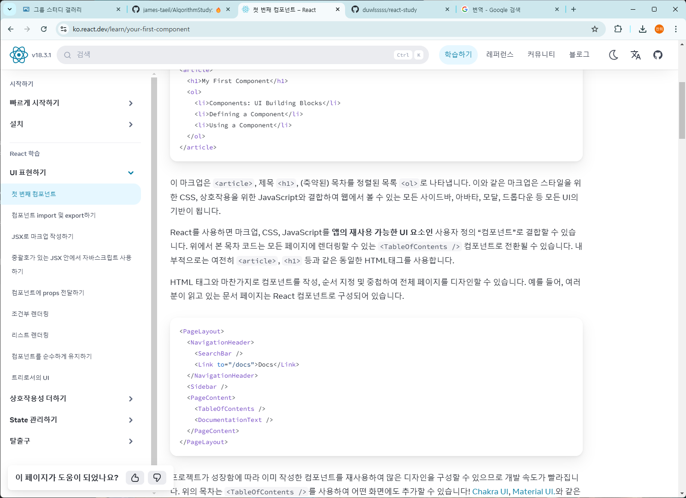

# First Component
  컴포넌트는 React의 핵심 개념으로 사용자 인터페이스(UI)를 구축하는 기반이 됩니다.

## 컴포넌트 구성 요소
웹에서는 HTML을 통해 `<h1>`, `<li>` 같은 태그를 사용하여 문서를 만들 수 있습니다.
```js
<article>
  <h1>나의 첫 컴포넌트</h1>
  <ol>
    <li>컴포넌트: 블럭 만들기</li>
    <li>컴포넌트 정의하기</li>
    <li>컴포넌트 사용하기</li>
  </ol>
</article>
```
`<article>`, `<h1>`, `<ol>` 등으로 제목과 목록을 만들어낸 마크업입니다. 이러한 마크업은 CSS, JS와 결합하여 웹에서 볼 수 있는 모든 사이드바, 모달 등 모든 UI의 기반이 됩니다.

React를 사용하면 마크업, CSS, JavaScript를 앱의 재사용 가능한 UI요소인 사용자 정의 '컴포넌트'(custom component)로 결합할 수 있습니다. 위에서 목차 코드는 모든 페이지에 랜더링 할 수 있는 `<TableOfContents/>` 컴포넌트로 전환될 수 있습니다. 내부적으로는 여전히 `<article>`, `<h1>` 등과 같은 동일한 HTML 태그를 사용합니다.

HTML 태그와 마찬가지로 컴포넌트를 작성, 순서 지정 및 중첩하여 전체 페이지를 디자인 할 수 있습니다. 예를 들어, React 공식 문서 페이지 또한 React 컴포넌트로 구성되어 있습니다.
```js
<PageLayout>
  <NavigationHeader>
    <SearchBar />
    <Link to="/docs">Docs</Link>
  </NavigationHeader>
  <Sidebar />
  <PageContent>
    <TableOfContents />
    <DocumentationText />
  </PageContent>
</PageLayout>
```


이미 작성한 컴포넌트를 재사용함으로써 많은 디자인을 구성할 수 있고 개발 속도가 빨라집니다. 

## 컴포넌트 정의하기
기존 웹페이지를 만들 때 웹 개발자가 컨텐츠를 마크업한 다음 JavaScript를 뿌려 상호작용을 추가했습니다. 이는 웹에서 상호작용이 중요했던 시절에 효과적이었으나 이제는 많은 사이트와 모든 앱에서 상호작용을 기대합니다. React는 동일한 기술을 사용하면서도 상호작용을 우선시합니다.
**React컴포넌트는 마크업으로 뿌릴 수 있는 JavasScript 함수입니다.**

```js
export default function Profile() {
  return (
    
  )
}
```

### 1단계: 컴포넌트 내보내기
`export default` 접두사는 표준 JavaScript 구문입니다. 이 접두사를 사용하면 다른 파일에서 가져올 수 있도록 파일에 주요 기능을 표시 할 수 있습니다.

### 2단계: 함수 정의하기
`function Profile() { }`을 사용하면 `Profile`이라는 이름의 JavaScript함수를 정의할 수 있습니다.

### 3단계: 마크업 추가하기
이 컴포넌트는 `src` 및 `alt` 속성을 가진 ``태그를 반환합니다. ``는 HTML처럼 작성되었지만 이 파일은 JavaScript입니다. 이 구문을 JSX라고 하며, JavaScript안에 마크업을 삽입할 수 있습니다.
반환문은 아래 예시 처럼 한 줄에 모두 작성 할 수 있습니다.
```js
return ;
```
하지만 마크업이 모두 `return` 키워드와 같은 라인에 있지 않은 경우에는 괄호로 묶어야 합니다.

괄호가 없으면 return 뒷 라인에 있는 코드는 무시됩니다.
```js
return(
   <div>
    
   </div>
);
```

## 컴포넌트 사용하기
`Profile` 컴포넌트를 정의했으므로 다른 컴포넌트 안에 중첩할 수 있습니다. 예를 들어 여러 `Profile` 컴포넌트를 사용하는 `Gallery`컴포넌트를 내보낼 수 있습니다.
```js
function Profile() {
  return (
    
  );
}

export default function Gallery() {
  return (
    <section>
      <h1>Amazing scientists</h1>
      <Profile />
      <Profile />
      <Profile />
    </section>
  );
}
```

### 브라우저에 표시되는 내용
대소문자 차이에 주의!
- `<section>`은 소문자이므로 React는 HTML태그를 가리킨다고 이해합니다.
- `<Profile />`은 대문자 `p`로 시작하므로 React는 `Profile`이라는 컴포넌트로 사용하고자 한다고 이해합니다.
`Profile`은 ``가 포함되어 있어 브라우저에 표시되는 내용은 아래와 같습니다.
```js
<section>
  <h1>Amazing scientists</h1>
  
  
  
</section>
```

### 컴포넌트 중첩 및 구성

컴포넌트는 일반 JavaScript함수이므로 같은 파일에 여러 컴포넌트를 포함할 수 있습니다. 컴포넌트가 상대적으로 작거나 밀접하게 관련되어 있을 때 편리합니다. 이 파일이 복잡해지면 언제든지 `Profile`을 별도의 파일로 옮길 수 있습니다.

`Profile` 컴포넌트는 `Gallery`안에서 랜더링되기 때문에 `Gallery`는 각 `Profile`을 "자식"으로 랜더링하는 부모 컴포넌트라고 할 수 있습니다. 컴포넌트를 한번 정의한 다음 원하는 곳에서 원하는 만큼 사용 할 수 있습니다.

단, 컴포넌트는 최상위 레벨에서 정의해야하며, 다른 컴포넌트 안에서 정의하게 되면 매우 느리고, 버그를 촉발하게 됩니다. 자식 컴포넌트에서 부모 컴포넌트의 일부 데이터가 필요한 경우, 정의를 중첩하는 대신 props로 전달해야 합니다.