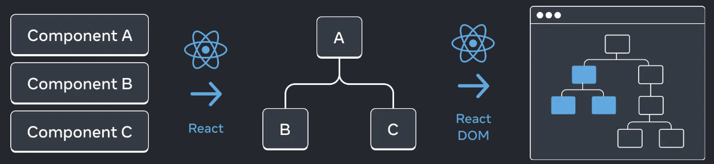
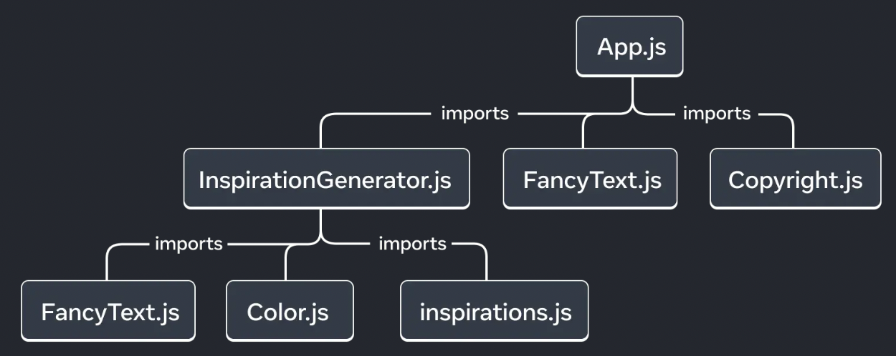

### 1. React의 트리 구조 UI 



React 앱은 서로 중첩된 여러 컴포넌트로 구성됨.
컴포넌트의 주요 특징은 중첩될 수 있다는 점임 부모 컴포넌트와 자식 컴포넌트의 개념이 생기며, 각 부모 컴포넌트는 다른 컴포넌트의 자식이 될 수 있음.
React는 이런 컴포넌트로부터 UI 트리를 생성함. UI 트리는 DOM을 렌더링하는 데 사용됨

트리 구조는 React 앱에서 데이터가 흐르는 방식과 렌더링 및 앱 크기를 최적화하는 방법을 이해하는 데 유용함


### 2. 렌더 트리

- React는 렌더링된 컴포넌트로 구성된 UI 트리인 렌더 트리를 생성함. 트리의 각 노드는 컴포넌트임
- 루트 노드는 앱의 Root 컴포넌트(React가 렌더링하는 첫 번째 컴포넌트)
- 최상위 컴포넌트는 그 아래의 모든 컴포넌트의 렌더링 성능에 영향을 미침, 리프 컴포넌트는 자주 다시 렌더링됨
- 트리의 각 화살표는 부모 컴포넌트에서 자식 컴포넌트를 가리킴

```jsx
// App.jsx
import FancyText from './FancyText';
import InspirationGenerator from './InspirationGenerator';
import Copyright from './Copyright';

export default function App() {
  return (
    <>
      <FancyText title text="Get Inspired App" />
      <InspirationGenerator>
        <Copyright year={2004} />
      </InspirationGenerator>
    </>
  );
}
```


### 3. 모듈 의존성 트리

- React 앱의 모듈 의존성을 나타냄
- 렌더 트리는 컴포넌트만 캡슐화, 의존성 트리는 **모듈도 트리에 표시**
- 번들러는 의존성 트리를 사용해 포함해야 할 모듈을 졀정함 
- 모듈 의존성 트리의 각 노드는 모듈, 각 가지는 해당 모듈의 import 문을 나타냄
- 루트 노드는 루트 모듈(엔트리 포인트 파일, 일반적으로 루트 컴포넌트를 포함함)




