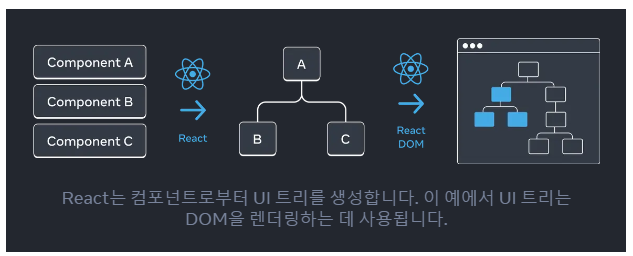

## React앱은 서로 중첩된 컴포넌트들로 구성되어 있는데, 이것을 어떻게 추적할까?

 



### 트리는 요소와 UI 사이의 관계 모델이다.

#### 위 사진에서 브라우저는 HTML(DOM)rhk CSS(CSSOM)를 모델링하기 위해 트리 구조를 사용하고 있다.

#### 참고로 모바일 플랫폼도 뷰 계층 구조를 나타내는데 트리를 사용한다

#### 왜냐하면 트리는 React 앱에서 데이터가 소통하는 방식과 랜더링 및 앱 크기를 최적화 하는 방법이기 때문이다.

 
## 렌더 트리
#### 컴포넌트의 주요 특징은 다른 컴포넌의 컴포넌트를 구성하는 것이다. 이것을 "중첩"이라 하고, 

#### 이를 바탕으로 부모와 자식 컴포넌트 개념이 생긴다.(부모는 다른 컴포넌트의 자식이 될 수 있다)

#### 렌더 트리는 React 컴포넌트로만 구성되므로 HTML태그는 렌더 트리에 존재하지 않는다.


### 아래 예시 코드를 보자

 
```javascript
export default function App() {
  return (
    <>
      <FancyText title text="Get Inspired App" />
      <InspirationGenerator>
        <Copyright year={2004} />
      </InspirationGenerator>
    </>
  );
}
```


#### 위의 렌더 트리를 구성한다.

#### 트리는 노드로 되어있으며, 각 노드는 컴포넌트를 나타낸다.

#### 즉 App과 InspirationGenerator, FancyText는 모두 트리의 노드(부모)이고 Root 컴포넌트는 App이다.

## 조건부 렌더 트리
 

#### 조건부 렌더링을 사용하면 렌더 트리가 다른 렌더링에서 변경될 수 있다..

##### 다른 prop 값으로 인해 컴포넌트가 다른 자식 컴포넌트를 렌더링할 수 있다..

```javascript
export default function App() {
  return (
    <>
      <FancyText title text="Get Inspired App" />
      <InspirationGenerator>
        <Copyright year={2004} />
      </InspirationGenerator>
    </>
  );
}
```

#### 이전 렌더 트리와 다르게 아래의 조건부가 추가되었다.

```javascript
<Copyright year={2004} />
 ```

#### 이를 렌더 트리로 나타내면 다음과 같다.

 
### 모듈 의존성 트리
#### 의존성 트리는 앱을 배포하기 위해 필요한 코드를 번들로 묶는 데 빌드 도구에서 사용된다.
#### 의존성 트리는 느리게 페인트되는 큰 번들 크기를 디버깅하는 데 유용하며, #### 어떤 코드를 번들로 묶을지 최적화할 기회를 제공한다.

 

##### 컴포넌트를 분리하고 로직을 별도의 파일로 분리하면 컴포넌트, 함수 또는 상수를 내보내는(export) JS 모듈을 만들 수 있다.

##### 모듈 의존성 트리의 각 노드는 모듈이며, 각 가지는 해당 모듈의 import문을 나타낸다.

### 이전 렌더 트리와 모듈 의존성 트리의 차이점
#### 트리를 구성하는 노드는 컴포넌트가 아닌 모듈을 나타낸다
##### inspirationGenerator.js와 같은 컴포넌트가 아닌 모듈도 이 트리에 나타낼 수 있다(렌더 트리는 컴포넌트만 캡슐화한다) <br>캡슐화란 ? -> 클래스 안에다가 데이터와 데이터를 처리하는 행위를 묶어 놓는 것
##### Copyright.js가 App.js에 나타난다. 즉 InspirationGenerator와의 같은 level에 위치하는데, 
##### 이것은 InspirationGenerator가 자식 props로 JSX를 허용하기 때문에 Copyright를 자식 컴포넌트로 랜더링하지만 모듈을 가져오지는 않기 때문이다.