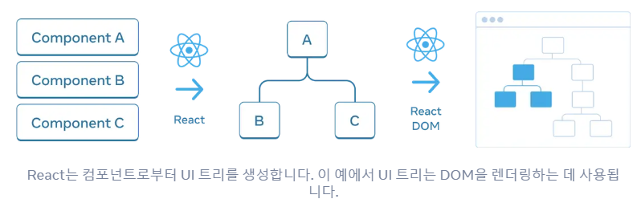
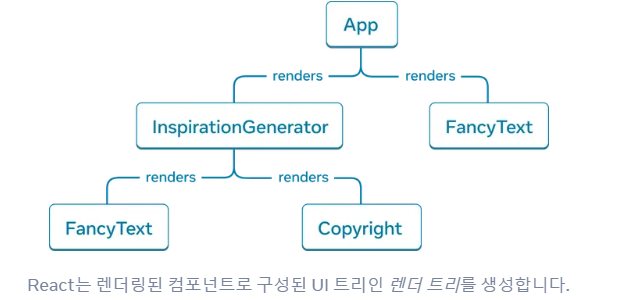
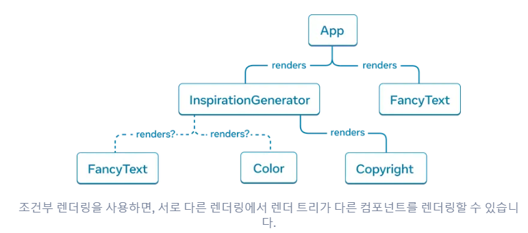
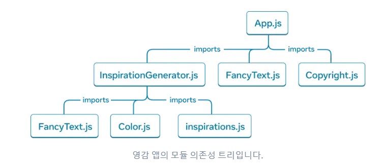

# 트리로서 UI 이해하기
React와 많은 다른 UI라이브러리는 UI를 트리로 모델링합니다. 애플리케이션을 트리로 생각하면 컴포넌트 간의 관계를 이해하는 데 도움이 됩니다. 이런 이해는 성능과 상태관리, 앞으로 배울 개념을 디버깅하는데 도움이 됩니다.

## 트리로서의 UI

트리는 요소와 UI사이의 관계 모델이며 UI는 종종 트리 구조를 사용하여 표현됩니다.<br>
브라우저에서는 HTML(DOM)과 CSS(CSSOM)를 모델링하기 위해 트리 구조를 사용<br>
모바일 플렛폼도 뷰 계층 구조를 나타내는데 사용

트리는 React 앱에서 데이터가 흐르는 방식과 랜더링 및 앱 크기를 최적화 하는 방법을 이해하는데 유용한 도구

## 랜더 트리
컴포넌트의 주요 특징은 다른 컴포넌트의 컴포넌트를 구성하는 것<br>
컴포넌트를 중첩함으로써 부모와 자식 컴포넌트의 개념이 생기며, 각 부모 컴포넌트는 다른 컴포넌트의 자식이 될 수 있습니다.
```js
export default function App() {
  return (
    <>
      <FancyText title text="Get Inspired App" />
      <InspirationGenerator>
        <Copyright year={2004} />
      </InspirationGenerator>
    </>
  );
}
```



위 예시 앱에서 사진과 같은 랜더 트리를 구상할 수 있습니다.<br>
트리는 노드로 구성 되어 있으며, 각 노드는 컴포넌트를 나타냅니다.(`App`,`FancyText` 등)

React 랜더 트리에서 루트 노드는 앱의 Root 컴포넌트로 React가 랜더링 하는 첫 번째 컴포넌트입니다.<br>
위 예시의 경우 루트 컴포넌트는 `App`이며 트리의 각 화살표는 부모컴포넌트에서 자식 컴포넌트를 가리킵니다.

조건부 랜더링을 사용하면 부모 컴포넌트에 전달된 데이터에 따라 다른 자식을 랜더링 할 수 있습니다.


조건부 랜더링의 경우 위와 같은 랜더 트리를 가질 수 있습니다.

## 모듈 의존성 트리

모듈 의존성 트리의 각 노드는 모듈이며, 각 가지는 모듈의 `import`문을 나타냅니다.

위 의존성 트리의 루트 노드는 루트 모듈이며, 엔트리 포인트 파일이라고 합니다. 일반적으로 루트 컴포넌트를 포함하는 모듈입니다.

동일한 앱의 랜더 트리와의 차이점
- 트리를 구성하는 노트는 컴포넌트가 아닌 모듈을 나타냄
- `inspirations.js`와 같은 컴포넌트가 아닌 모듈도 트리에 나타남(랜더 트리는 컴포넌트만 캡슐화)
- `Copyright.js`가 `App.js` 아래에 나타나지만, 렌더 트리에서 `Copyright` 컴포넌트는 `InspirationGenerator`의 자식으로 나타납니다. 이는 `InspirationGenerator`가 자식 props로 JSX를 허용하기 때문에, `Copyright`를 자식 컴포넌트로 렌더링하지만 모듈을 가져오지는 않기 때문입니다.

의존성 트리는 React 앱을 싱행하는 데 필요한 모듈을 결정하는데 유용합니다.<br>
번들러: 일반적으로 클라이언트에 제공할 모든 필요 JavaScript를 번들로 묶는 빌드 담당

앱의 최적화를 위해 의존성 트리를 사용하면 도움이 될 수 있습니다.