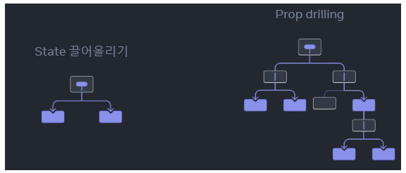
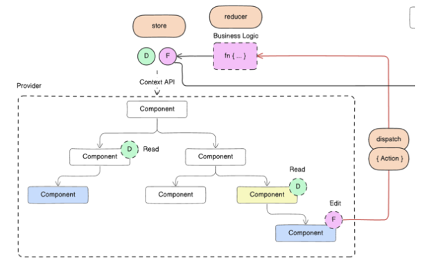
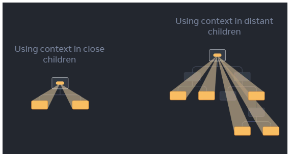

# 보통의 경우 
####  부모 컴포넌트에서 자식 컴포넌트로 props를 통해 "내려"주어 정보를 전달한다.

#### 그러나 중간에 많은 컴포넌트를 거쳐야 하거나, 애플리케이션의 많은 컴포넌트에서 동일한 정보가 필요할 경우에는

#### props를 전달하는것이 번거롭고 불편할 수 있다.

#### Context는 부모 컴포넌트가 트리 아래에 있는 모든 컴포넌트가 깊이에 상관없이 정보를 명시적으로 #### props를 통해 전달하지 않고도 사용할 수 있게 해준다.

 

### Prop drilling이란 ? :  
- '하위 컴포넌트로 전달하는 용도로만 쓰이는' 컴포넌트들을 거치면서 React Component 트리의 한 부분에서 다른 부분으로 데이터를 전달하는 과정



#### 해당 컴포넌트에 Props를 "내려"주는 것이 아닌, "순간이동"으로 전달하면 어떨까?

 

### 그것이 바로 Context이다 !

### 아래의 예시를 보자
#### 같은 Section 내의 여러 제목이 항상 동일한 크기를 가져야 한다고 가정해보면,

```javascript
export default function Page() {
  return (
    <Section>
      <Heading level={1}>Title</Heading>
      <Section>
        <Heading level={2}>Heading</Heading>
        <Heading level={2}>Heading</Heading>
        <Section>
          <Heading level={3}>Sub-heading</Heading>
          <Heading level={3}>Sub-heading</Heading>
          <Section>
            <Heading level={4}>Sub-sub-heading</Heading>
            <Heading level={4}>Sub-sub-heading</Heading>
          </Section>
        </Section>
      </Section>
    </Section>
  );
}
 ```

##### 위 코드에서 각각의 <Heading>에 level prop을 전달하고 있음을 확인할 수 있다.

```javascript
<Section>
  <Heading level={3}>About</Heading>
  <Heading level={3}>Photos</Heading>
  <Heading level={3}>Videos</Heading>
</Section>

// Heading의 부모 컴포넌트인 Section에 prop을 한 번만 전달하여, Headoing에는 전달하지 않아도..

<Section level={3}>
  <Heading>About</Heading>
  <Heading>Photos</Heading>
  <Heading>Videos</Heading>
</Section>
```
### 하지만 어떻게 `<Heading>` 컴포넌트가 가장 가까운 `<Section>`의 레벨을 알 수있을까?

#### 그 방법은 자식에게 트리 위 어딘가에 있는 데이터를 "요청하는" 방법이 필요하다.


#### 이 방법은 Props로만은 불가능하고, Context개념을 추가해야 한다.
 
 

### Context를 활용하는 방법은 다음의 절차를 따른다.


- Context를 생성(예를 들어 제목 레벨을 위한 것이므로 LevelContext로 명명)
- 데이터가 필요한 컴포넌트에서 context 사용(Heading에서는 LevelContext를 사용)
- 데이터를 지정하는 컴포넌트에서 context를 사용(Section에서는 LevelContext를 제공)
 

### 그럼 코드로 직접 확인해봅시다 Go!
 

### 1. Context 생성하기
```javascript
import { createContext } from 'react';
 // 컴포넌트에서 사용할 수 있도록 내보낸다.
export const LevelContext = createContext(1); // 1은 가장 큰 제목 레벨은 나타내지만 모든 종류(객체) 가능
 ```

### 2. Context 사용하기
#### 2-1 React에서 useContext Hook과 생성한 Context를 가져온다.

```javascript
import { useContext } from 'react';
import { LevelContext } from './LevelContext.js';
 ```


#### 2-2 데이터 읽어오는 방식을 props에서 useContext를 사용으로 수정한다.

```javascript
export default function Heading({ level, children }) { // 기존 코드 props로 level을 받는다.
// ...
}

export default function Heading({ children }) {
  const level = useContext(LevelContext); // 이전 코드에서 생성한 Context
  // ...
}
 ```

#### useContext는 Hook으로, "순수"해야한다.

#### useState, useReducer와 같이 Hook은 React 컴포넌트의 바로 안에서만 호출해야한다(반복문이나 조건문 내부가 아닌)

#### useContext의 역할은 React에게 Heading 컴포넌트가 LevelContext를 읽으려 한다고 알려주는 것

 

#### 이를 통해 Section이 대신 level을 받도록 JSX를 업데이트할 수 있다. 

 ```javascript
<Section level={4}> 
  <Heading>Sub-sub-heading</Heading>
  <Heading>Sub-sub-heading</Heading>
  <Heading>Sub-sub-heading</Heading>
</Section>
 ```

### 하지만!  아직 모든 값이 <h1>태그로 값이 출력될 것이다
### 왜? ->
 
#### Context를 사용하고 있지만, React에게 아직 제공하지 않았기 때문에 React가 어디서 값을 가져와야 할지 모르기 때문이다.

#### Context를 제공하지 않으면 React는 이전 단계에서 지정한 기본값을 사용한다.

#### 우리가 처음에 useContext를 다음과 같이 선언했다.

```javascript
export const LevelContext = createContext(1);
```
#### 따라서 useContext(LevelContext)가 1을 반환하고 있다.

### 이제 각각의 Section이 고유한 context를 제공하여 이를 해결해보자

 

### 3. Context 제공하기(context provider)
#### 현재 Section 컴포넌트는 자식들을 다음과 같이 렌더링하고 있다.

```javascript
export default function Section({ children }) {
  return (
    <section className="section">
      {children}
    </section>
  );
}
 ```

#### LevelContext를 자식들에게 제공하기 위해 context Provider로 감싸준다

 
### 아하! React에게 Context를 제공하려면 context provider로 감싸주면 되는구나!!를 기억하기 바란다.

```javascript
export default function Section({ level, children }) { // section.js
  return (
    <section className="section">
      <LevelContext.Provider value={level}>
        {children}
      </LevelContext.Provider>
    </section>
  );
}
 ```

#### 이것을 통해 React에게 Section 내의 어떤 컴포넌트가 LevelContext를 요구하면 level을 주라고 할 수 있다.

#### 컴포넌트는 그 위에 있는 UI 트리에서 가장 가까운 <LevelContext.Provider>의 값을 사용한다.

 

### level의 값에 따라 변화를 확인하기 위해 .. case를 나눠보면?

```javascript
// Hading.js
import { useContext } from 'react';
import { LevelContext } from './LevelContext.js';

export default function Heading({ children }) {
  const level = useContext(LevelContext);
  switch (level) {
    case 1:
      return <h1>{children}</h1>;
    case 2:
      return <h2>{children}</h2>;
    case 3:
      return <h3>{children}</h3>;
    default:
      throw Error('Unknown level: ' + level);
  }
}
```

#### 이제 Heading과 Section 모두 자신들이 얼마나 "깊이" 있는지 확인하기위해 LevelContext를 읽는다.

#### 현재 `<h1>`태그를 사용했는데, 이것은 현재 색상 테마, 현재 로그인된 사용자 등 전체 하위트리에 필요한 정보를 전달할 수 있음에 `유의`하라
 

### Context로 중간 컴포넌트 지나치기
#### Context를 사용하면 "주변에 적응"하고 렌더링 되는 위치(또는 어떤 context)에 따라 자신을 다르게 표시하는 컴포넌트를 작성할 수 있다.

 

```javascript
export default function ProfilePage() {
  return (
    <Section>
      <Heading>My Profile</Heading>
      <Post
        title="Hello traveller!"
        body="Read about my adventures."
      />
      <AllPosts />
    </Section>
  );
}

function AllPosts() {
  return (
    <Section>
      <Heading>Posts</Heading>
      <RecentPosts />
    </Section>
  );
}

function RecentPosts() {
  return (
    <Section>
      <Heading>Recent Posts</Heading>
      <Post
        title="Flavors of Lisbon"
        body="...those pastéis de nata!"
      />
      <Post
        title="Buenos Aires in the rhythm of tango"
        body="I loved it!"
      />
    </Section>
  );
}

function Post({ title, body }) {
  return (
    <Section isFancy={true}>
      <Heading>
        {title}
      </Heading>
      <p><i>{body}</i></p>
    </Section>
  );
}
 ```


#### 부모 컴포넌트에서 자식 컴포넌트로 각각을 구성하면서 내부의 <Heading>이 가장 가까운 <Section>에서 자동으로 level값을 가져온다.

#### 이를 통해 서로 다른 React context는 영향을 주지 않음 또한 확인할 수 있다.

 

### Context를 사용하기 전에 고려할 것
#### 어떤 props를 여러 레벨 깊이로 전달해야 한다고 해서 해당 정보를 context에 넣어야 하는 것은 아니다.

#### 다음의 사항을 고려하여 적용을 추천하고, 이 접근 방법들이 잘 맞지 않는다면 context를 고려한다.

- Props "내려" 전달하기
    - 여러개의 props가 여러 컴포넌트를 거쳐 가는 것은 "일반적"인 경우이다.
    - 이를 통해 데이터의 사용과 흐름이 명확해져 코드를 유지보수 하기에 좋다
-컴포넌트를 추출하고 JSX를 children으로 전달하기
    - 목표로한 컴포넌트가 아닌이상 그의 부모 컴포넌트는 이를 "내려"주는 역할만 수행하는데, 예를 들어 posts처럼 직접 사용하지 않는 props를 <Layout posts={posts} />와 같이 전달할 것이라 생각할 수 있는데, Layout은 Children을 prop으로 받고, <Layout><Posts posts={posts}/></Layout>처럼 렌더링하면 <User posts = {posts}/>처럼 다른 곳에서 posts의 값을 "내려"줄 때에도 데이터를 지정하는 컴포넌트와 데이터가 필요한 컴포넌트 사이의 층수가 줄어든다.
 

### 그렇다면 언제 Context를 사용할까?
 

- 테마 지정하기
    - 사용자가 모양을 변경할 수 있는 애플리케이션(다크 모드) context provider를 앱 최상단에 두고 사용
- 현재 계정
    - 로그인한 사용자를 알아야 하는 컴포넌트가 많을 수 있는데, Context에 놓으면 어디에서나 데이터 확인 가능
- 라우팅
    - 대부분은 현재 경로를 유지하기 위해 내부적으로 context를 사용한다. 왜냐하면 모든 링크의 활성화 여부를 "알수 있는" 방법이기 때문이다.
- 상태 관리
    - 애플리케이션이 커지면 결국 앱 상단에 수많은 state가 생긱게 된다. 매우 깊은 컴폰너트에서 그 값을 변경하려고 할 때 props를 단순히 "내려"전달해주려면 복잡하기에, reducer와 context를 함께 사용하는 것은 복잡한 state를 관리하고 번거로운 작업없이 멀리 있는 컴포넌트까지 값을 전달하는 방법이다.
 