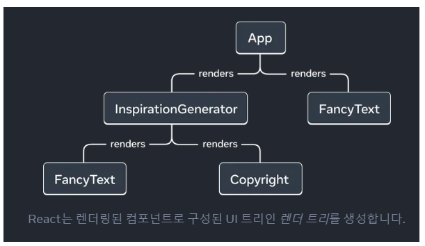
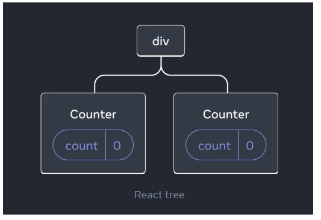
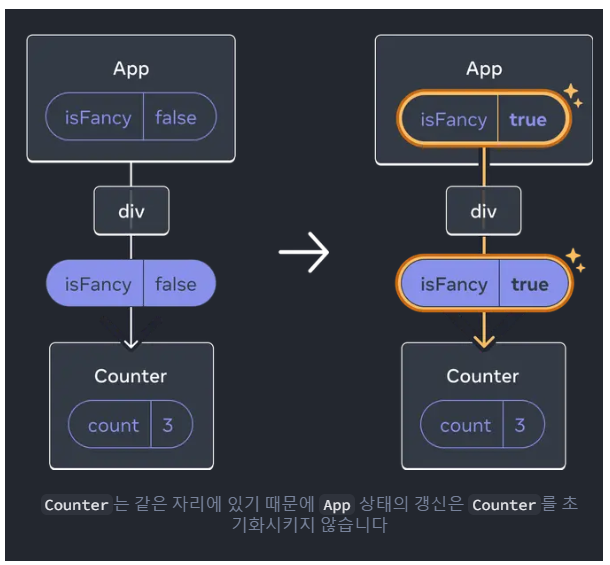
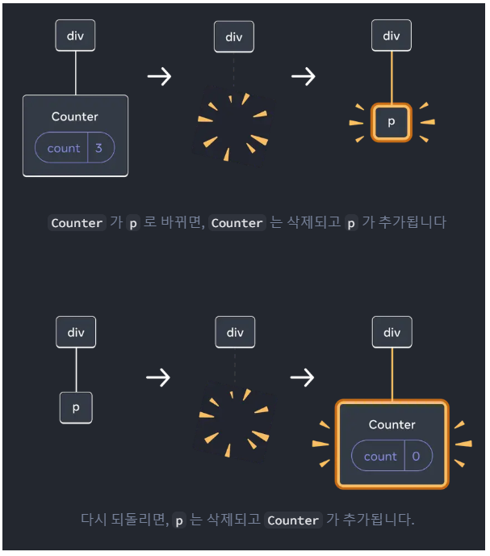
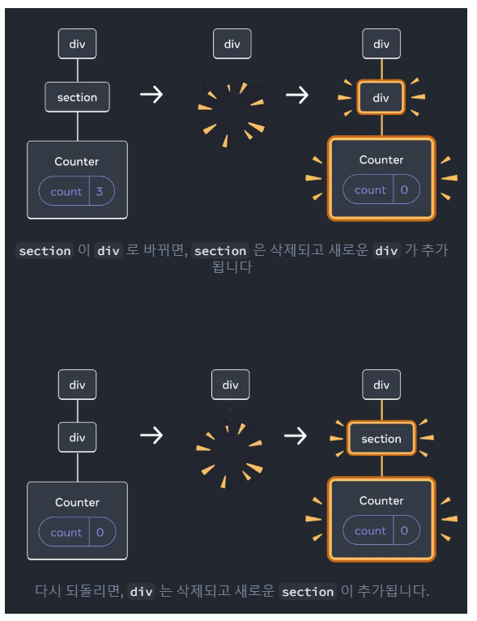

### 리렌더링마다 언제 state를 보존하고 또 state를 초기화할지 컨트롤 할 수 있다.

### State는 렌더트리의 위치에 연결된다.


#### 아래의 예시 코드를 살펴보자

```javascript
export default function App() {
  const counter = <Counter />;
  return (
    <div>
      {counter}
      {counter}
    </div>
  );
}
```

#### `<Counter />`가 하나의 `div` 태그안에 있지만, 이것은 각각 독립된 객체임을 학습했었다.

#### 따라서 다음의 트리 구조를 갖음을 예상할 수 있다.



#### 각각 트리에서 자기 고유의 위치에서 렌더링 되어 있으므로 분리되어 있는 카운터이다.
#### 따라서 특정 카운터가 갱신된다면 해당 컴포넌트의 상태만 갱신된다.

### 자세히 설명하기 전에 React의 특징에 대해 살펴보자
- React는 트리의 동일한 컴포넌트를 동일한 위치에 렌더링하는 동안 상태를 유지한다.
- React가 컴포넌트를 제거할 때 그 state도 같이 제거한다.

### 그럼 각각에 대해 더 자세히 살펴보자

### 1-1. React는 트리의 동일한 컴포넌트를 동일한 위치에 렌더링하는 동안 상태를 유지한다

#### React는 JSX  마크업(예를 들면 if문)에서가 아닌 UI 트리에서의 위치의 값을 확인한다.
##### 아래의 코드를 살펴보면, 체크 박스를 통해 isFancy의 값을 true 또는 false로 설정하고 있다.

#### 그렇다면 isFancy의 값을 변경하면 count의 값도 변경될까?

```javascript
export default function App() {
  const [isFancy, setIsFancy] = useState(false);
  return (
    <div>
      {isFancy ? (
        <Counter isFancy={true} /> 
      ) : (
        <Counter isFancy={false} /> 
      )}
}
```

#### 정답은 그렇지 않다!이다
### 왜냐하면 ...
#### isFancy가 true이든 false이든 `<Counter/>`는 같은 위치에 있다.
### 이것을 시각적으로 살펴보자면 ..


#### 첫 번째 자리의 같은 컴포넌트이기 때문에 React 관점에서는 같은 카운터이다.

### 2.  같은 위치의 다른 컴포넌트는 state를 초기화한다.

#### 아래의 예시 코드는 체크 박스를 통해 `isPaused`의 값을 `true` 또는 `false`로 변화시키고 있다.

#### 이를 통해 `true`인 경우엔 `<p>`태그가, `false`인 경우 `<Counter />`의 값이 출력된다.

```javascript
export default function App() {
  const [isPaused, setIsPaused] = useState(false);
  return (
    <div>
      {isPaused ? (
        <p>See you later!</p> 
      ) : (
        <Counter /> 
      )}
      <label>
        <input
          type="checkbox"
          checked={isPaused}
          onChange={e => {
            setIsPaused(e.target.checked)
          }}
        />
        Take a break
      </label>
    </div>
  );
}
```

#### 이때 같은 `<div>`태그 첫번째 요소안에서 변경하기 때문에

#### 같은 자리의 컴포넌트를 다른 컴포넌트 타입으로 변경한다고 할 수 있다.

#### 처음 isPaused의 값이 false로 <Counter /> 컴포넌트를 출력하지만 true로 바꾸면 `p` 컴포넌트 출력을 위해 
#### React는 UI 트리에서 Counter와 그 state를 제거한다.

#### 이 내용을 시각적으로 살펴보면 ..


#### 또한 같은 위치의 다른 컴포넌트를 렌더링할 때 React는 그의 전체 서브 트리의 state를 초기화한다.

#### 체크박스를 통해 isFancy의 값을 변경시키는데, 이때 자식 컴포넌트인 Counter의 값도 초기화된다.

```javascript
export default function App() {
  const [isFancy, setIsFancy] = useState(false);
  return (
    <div>
      {isFancy ? (
        <div>
          <Counter isFancy={true} /> 
        </div>
      ) : (
        <section>
          <Counter isFancy={false} />
        </section>
      )}
      <label>
        <input
          type="checkbox"
          checked={isFancy}
          onChange={e => {
            setIsFancy(e.target.checked)
          }}
        />
        Use fancy styling
      </label>
    </div>
  );
}
function Counter({ isFancy }) { // isFancy의 자식 컴포넌트
```

#### div의 첫 번째 자식으로 Counter를 렌더링하는 것에서 section을 첫 번째 자식으로 변경할 때
#### 즉,div의 자식이 DOM에서 제거될 때 그것의 전체 하위 트리(Counter와 그 state 값들..)은 제거 된다.

### 이것을 시각적으로 살펴보면...

#### 우리는 이러한 경험을 바탕으로, 리렌더링할 때 state의 값을 유지시키고 싶다면, 트리 구조가 "동일"해야함을 알 수있다.

### 토막 상식 : 컴포넌트 함수를 중첩해서 정의하면 안 된다.

### 왜 ? -> 

#### 같은 함수에서 다른 컴포넌트를 렌더링할 때마다 React는 그 아래의 모든 state의 값을 초기화하기 때문이다.
#### 이러한 문제를 피하려면 항상 컴포넌트를 중첩해서 정의하지 않고, 최상위 범위에서 독립적으로 정의해야 한다.

### 2. 의도적으로 같은 위치에서 state를 초기화하기
#### 위의 내용을 통해 React는 컴포넌트가 같은 위치를 유지하면 state를 유지한다고 배웠다.

#### 그럼 의도적으로 같은 위치의 state를 초기화하려면?
- 다른 위치에 컴포넌트를 렌더링하기
- 각 컴포넌트에 key로 명시적인 식별자를 제공하기

### a. 다른 위치에 컴포넌트를 렌더링하기
#### 다음의 로직을 살펴보자
```javascript
      {isPlayerA ? ( // 기존 CountState 값 유지
        <Counter person="Taylor" />
      ) : (
        <Counter person="Sarah" />
      )}
      
      {isPlayerA && // person이 바뀌면 CountState 값 초기화
        <Counter person="Taylor" />
      }
      {!isPlayerA &&
        <Counter person="Sarah" />
      }
      <button onClick={() => {
        setIsPlayerA(!isPlayerA);
      }}>
```


#### isPlayerA의 값이 true 또는 false로 값이 변경되면서, Counter의 값이 각각 다른 위치로 이동한다.

### b. key를 이용해 state를 초기화하기
#### 우선, 우리는 지난 상호작용성 더하기에서 배열을 렌더링할 때 key에 대한 정의를 학습했다.

#### 배열에서 각 인덱스를 구분하는 값이었는데, React가 컴포넌트를 구별할 수 있도록 key를 사용할 수 있다.

```javascript
      {isPlayerA ? (
        <Counter key="Taylor" person="Taylor" />
      ) : (
        <Counter key="Sarah" person="Sarah" />
      )}
```
#### Taylor과 Sarah를 바꾸지만, state를 유지하지 않는다.

#### 각각 다른 `key`를 주었기에 ! 

#### 이렇게 key륽 명시하면 React는 부모 내에서 순서를 대신에 key 자체를 위치의 일부로 사용한다.

#### 이것이 컴포넌트를 JSX에서 같은 자리에 렌더링하지만 React 관점에서는 다른 카운터인 이유이다.


### !주의사항! : key가 전역적으로 유일하지않음에 주의, key는 오직 부모 안에서만 자리를 명시한다.

### Key를 이용해 폼을 초기화하기

#### 만약 채팅앱에서 <Chat> 컴포넌트는 contact라는 문자열 입력 state를 가지고 있다고 생각해보자.

```javascript
<Chat contact={to} />
```
#### 이때, to의 값을 설정하고  contact의 값을 변경해도 to의 값은 변경되지 않는다

#### 이것은 채팅 앱에서는 안된다 !

#### 따라서 아래와 같이 key를 추가해보자
```javascript
<Chat key={to.id} contact={to} />
```

#### 이를 통해 contact의 값을 변경하여 다른 수신자를 선택할 때 Chat 컴포넌트가 #### 그 트리에 있는 모든 state를 포함해서 처음부터 다시 생성된다.

#### React는 DOM 엘리먼트도 재사용하지 않고 새로 만들 것이다(그렇게 설계 되었으니까)

 