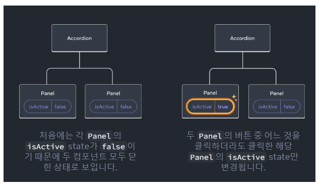
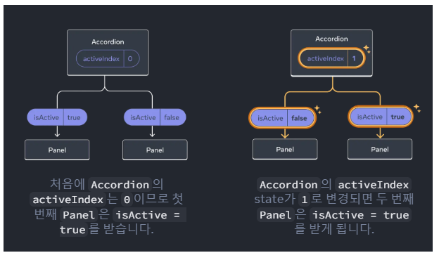

# 두 컴포넌트의 state가 항상 함께 변경되기를 원할 수 있다.

#### 그렇게 하려면 각 컴포넌트에서 state를 제거하고 가장 가까운 공통 컴포넌트로 옮긴 후 props로 "내려" 전달해야한다. 이것을 State 끌어올리기라 한다.


### 학습 내용
- State 끌어올리기를 통해 컴포넌트 간 state를 공유하는 방법
- 제어 컴포넌트와 비제어 컴포넌트

```javascript
// 자식 컴포넌트
function Panel({ title, children }) {
  const [isActive, setIsActive] = useState(false);
  return (
    <section className="panel">
      <h3>{title}</h3>
      {isActive ? (
        <p>{children}</p> // With a population ... OR The name comes ...
    </section>
  );
}

// 부모 컴포넌트
export default function Accordion() {
  return (
    <>
      <h2>Almaty, Kazakhstan</h2>
      <Panel title="About"> // Panel 1
      </Panel>
      <Panel title="Etymology"> // Panel 2
      </Panel>
    </>
  );
}
```

#### 실제로 실행해보면, 동일한 이름의 Panel 컴포넌트이지만, 각각 다른 state 값(독립적)을 확인할 수 있다.

### 아래의 사진을 통해 시각적으로 확인해보자



### 이제 두 개의 Panel이 동시에 show되는 현상을 막고자 한다.

#### 두 패널을 조정하려면 다음의 세 단게를 통해 부모 컴포넌트로 패널의 "State 끌어올리기"가 필요하다.

### Step 1: 자식 컴포넌트에서 state 제거

#### 우선 Panel 컴포넌트에 선언한 다음의 줄을 삭제한다.

```javascript
const [isActive, setIsActive] = useState(false);
```

#### 대신 Panel의 prop 목록에 isActive를 추가하여 부모로 부터 "내려"받는다
```
function Panel({ title, children, isActive }) {
```

### Step 2: 하드 코딩된 데이터를 부모 컴포넌트로 전달

#### state를 끌어올리려면, 조정하려는 두 자식 컴포넌트의 가장 가까운 "공통" 부모 컴포넌트에 둔다.
##### 왜냐하면 그래야 "내려"받는 컴포넌트의 수가 가장 적기 때문이다.

```javascript
export default function Accordion() {
  return (
    <>
      <h2>Almaty, Kazakhstan</h2>
      <Panel title="About" isActive={false}> // 동시에 true
      </Panel>
      <Panel title="Etymology" isActive={false}> // 동시에 true.
      </Panel>
    </>
  );
}

function Panel({ title, children, isActive }) {
  return (
        <button onClick={() => setIsActive(true)}>
          Show
        </button>
  );
}
```

### Step 3: 공통 부모에 state 추가

#### 상태 끌어올리기는 종종 state로 저장하고 있는 것의 특성(자료형 등)을 바꾼다.
#### 지금 우리가 원하는 것은 한 번에 하나의 Panel만 show하는 것이다.

#### 이를 위해 공통 부모 컴포넌트인 Accordian은 어떤 패널이 활성화된 패널인지 추적하고 있어야 한다.
#### state 변수에 boolean 값을 사용하는 대신, 활성화되어있는 Panel 인덱스 숫자를 사용할 수 있다.

```javascript
const [isActive, setIsActive] = useState(false); // 기존 코드를
const [activeIndex, setActiveIndex] = useState(0); // 이렇게
```

### 그렇다면 왜 인덱스를 사용했을까?
#### 그 이유는 다음과 같다.
- 패널 수의 제한
- 확장성 부족
- 가독성 및 유지보수성

#### activeIndex가 0이면 첫 번째 Panel이, 1이면 두 번째 Panel이 활성화 된 것이라 생각해보자

#### 각 Panel에서 "Show" 버튼을 클릭하면 Accordion의 활성화된 인덱스의 값을 변경해야 한다.

#### activeIndex state는 Accordion 내에서 정의되었기에 Panel은 값을 직접 설정할 수 없다.

 
#### 따라서, Accordion 컴포넌트는 Panel 컴포넌트가 state를 변경할 수 있음을 이벤트 핸들러를 prop으로 전달하기를 통해 명시적으로 허용해야 한다.

```javascript
<>
  <Panel
    isActive={activeIndex === 0} // prop으로 전달
    onShow={() => setActiveIndex(0)}
  >
    ...
  </Panel>
  <Panel
    isActive={activeIndex === 1} // prop으로 전달
    onShow={() => setActiveIndex(1)}
  >
    ...
  </Panel>
</>
```

#### 이렇게 상태 끌어올리기가 완성되었다 !

#### state를 공통 부모 컴포넌트로 옮겨 두 패널을 조정할 수 있게 되었다.

#### 두개의 "Show" 플래그 대신 활성화된 인덱스를 사용하는 것으로 한 번에 하나의 패널만 활성화됨이 보장된다.

#### 그리고 자식 컴포넌트로 이벤트 핸들러를 전달하는 것은 자식 컴포넌트에서 부모의 상태를 변경할 수 있게 한다.


### 이를 시각적으로 확인해보면..


### 제어와 비제어 컴포넌트

#### "제어되지 않은" 몇몇 지역 state를 갖는 컴포넌트를 사용하는 것은 흔한 일이다.

#### 예를 들어 위에서 처음 작성한 isActive state를 갖는 원래의 Panel 컴포넌트는 #### 해당 컴포넌트의 부모에서 패널 활성화에 영향을 줄 수 없기 때문에 제어되지 않는다.

 

#### 반대로 컴포넌트의 중요한 정보 자체가 자체 지역 state 대신 props에 의해 만들어지는 경우 컴포넌트가 "제어"된다고 한다.

#### 이를 통해 부모 컴포넌트가 동작을 완전히 지정할 수 있다.

#### 마지막에 작성한 isActive prop을 갖는 최종 Panel 컴포넌트는 Accordion 컴포넌트에 의해 제어된다.


### 각 state의 단일 진리(모든 state가 한 곳에 존재하는 것이 아닌 그 정보를 가지고 있는 특정 컴포넌트가 존재)

#### React에서 많은 컴포넌트는 자체 state를 가진다.

#### 리프 컴포넌트(트리 맨 아래에 있는 컴포넌트) 또는 앱의 상단에서 "생존" 할 수 있다.

#### 예를 들면 클라이언트 측 라우팅 라이브러리도 현재 경로를 React state로 저장하고 props로 전달하도록 구현되어 있다.

 

#### 각각의 고유한 state에 대해 어떤 컴포넌트가 "소유"할지 고를 수 있다.

### 이 원칙은 "단일 진리"를 갖는다.

#### 이를 통해 컴포넌트 간의 공유된 state를 중복하는 대신 공통 부모로 끌어올리고 필요한 자식에게 전달하자